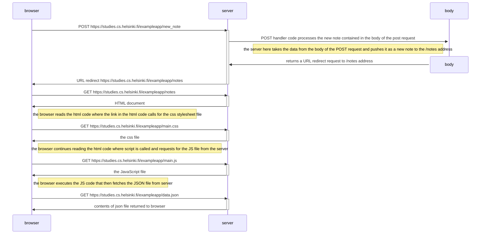

```mermaid
sequenceDiagram
    participant browser
    participant server

    browser->>server: POST https://studies.cs.helsinki.fi/exampleapp/new_note
    activate server

    create participant body
    activate body
    server->>body: POST handler code processes the new note contained in the body of the post request

    Note left of body: the server here takes the data from the body of the POST request and pushes it as a new note to the /notes address

    destroy body
    body->>server: returns a URL redirect request to /notes address  

    server->>browser: URL redirect https://studies.cs.helsinki.fi/exampleapp/notes
    deactivate server

    browser->>server: GET https://studies.cs.helsinki.fi/exampleapp/notes
    activate server
    server->>browser: HTML document
    deactivate server

    Note right of browser: the browser reads the html code where the link in the html code calls for the css stylesheet file

    browser->>server: GET https://studies.cs.helsinki.fi/exampleapp/main.css
    activate server
    server->>browser: the css file
    deactivate server

    Note right of browser: the browser continues reading the html code where script is called and requests for the JS file from the server

    browser->>server: GET https://studies.cs.helsinki.fi/exampleapp/main.js
    activate server
    server->>browser: the JavaScript file
    deactivate server

    Note right of browser: the browser executes the JS code that then fetches the JSON file from server

    browser->>server: GET https://studies.cs.helsinki.fi/exampleapp/data.json
    activate server
    server->>browser: contents of json file returned to browser
    deactivate server
```

    

    
    
